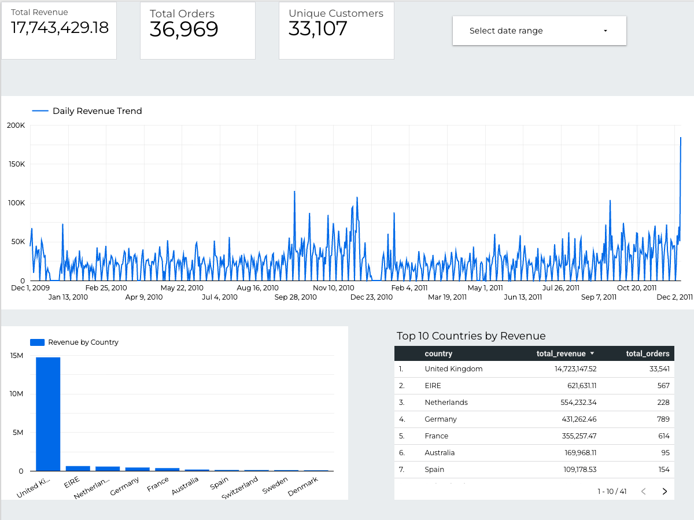
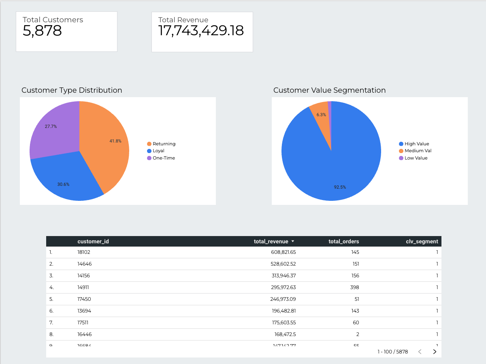
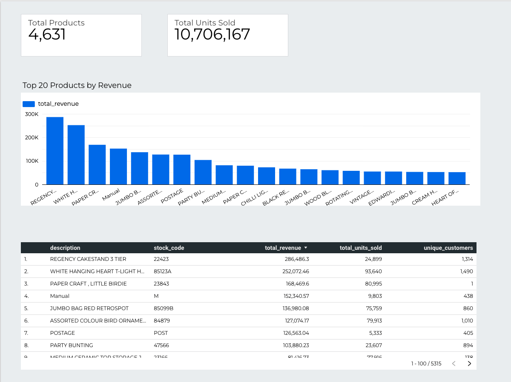

# RetailIQ — dbt Analytics Engineering Pipeline

**End-to-end dbt analytics engineering pipeline on Google BigQuery processing 1,067,371 UK retail transactions with modular SQL transformation layers, automated data quality testing, and interactive Looker Studio dashboard.**

## 🔗 Live Dashboard
**[View Live Looker Studio Dashboard](https://datastudio.google.com/reporting/d15c6d64-08c4-4a39-bf3e-0c7e2b89612e)**

## 🏗️ Architecture
Raw Data (BigQuery)

↓

Staging Models (dbt) — clean and standardise

↓

Intermediate Models (dbt) — business logic

↓

Mart Models (dbt) — analytical tables

↓

Looker Studio Dashboard — 3-page interactive report

## 📊 Dashboard Pages

### Page 1 — Sales Performance
- Total Revenue: £17,743,429
- Total Orders: 36,969
- Unique Customers: 33,107
- Daily Revenue Trend (Dec 2009 — Dec 2011)
- Revenue by Country
- Top 10 Countries by Revenue

### Page 2 — Customer Analytics
- Total Customers: 5,878
- Customer Type Distribution (Returning/Loyal/One-Time)
- Customer Lifetime Value Segmentation (High/Medium/Low)
- Top 10 Customers by Revenue

### Page 3 — Product Performance
- Total Products: 4,631
- Total Units Sold: 10,706,167
- Top 20 Products by Revenue
- Full Product Performance Table

## 🗂️ dbt Model Layers

### Staging
| Model | Description |
|---|---|
| `stg_retail__invoices` | Cleaned invoice transactions — filters returns, nulls, and invalid prices |
| `stg_retail__customers` | Deduplicated customer list with country |

### Intermediate
| Model | Description |
|---|---|
| `int_retail__order_items` | Order items with date dimensions extracted |
| `int_retail__customer_orders` | Customer-level order aggregations |

### Marts
| Model | Description |
|---|---|
| `mart_sales__daily` | Daily sales performance by country |
| `mart_customers__lifetime_value` | CLV segmentation — High/Medium/Low Value |
| `mart_products__top_performers` | Product revenue and volume rankings |

## ✅ Data Quality Tests
- 8 automated dbt tests — all passing
- not_null tests on all key fields
- unique test on customer_id
- Data validated before every mart build

## 🛠️ Tech Stack
- **dbt Core 2.0** — SQL transformation framework
- **Google BigQuery** — Cloud data warehouse
- **Python** — Data loading and preprocessing
- **Looker Studio** — Interactive dashboard
- **Pandas / openpyxl** — Excel to CSV conversion

## 📁 Dataset
- **Source:** UCI Online Retail II Dataset
- **Records:** 1,067,371 transactions
- **Period:** December 2009 — December 2011
- **Coverage:** UK-based online retailer, 41 countries

## 🚀 How to Run

### Prerequisites
- Python 3.9+
- dbt-bigquery
- Google Cloud account with BigQuery enabled
- Service account JSON key

### Setup
```bash
pip install dbt-bigquery
git clone https://github.com/VinitBhalerao3012/retailiq-dbt-pipeline.git
cd retailiq-dbt-pipeline
```

### Configure Profile
```yaml
# ~/.dbt/profiles.yml
retailiq:
  target: dev
  outputs:
    dev:
      type: bigquery
      method: service-account
      keyfile: /path/to/your/keyfile.json
      project: your-project-id
      dataset: retailiq
      threads: 16
      location: europe-west2
```

### Run Pipeline
```bash
dbt run      # Run all 7 models
dbt test     # Run 8 data quality tests
```

## 👤 Author
**Vinit Bhalerao**
- Portfolio: [vinitbportfolio.netlify.app](https://vinitbportfolio.netlify.app)
- GitHub: [github.com/VinitBhalerao3012](https://github.com/VinitBhalerao3012)
- LinkedIn: [linkedin.com/in/bhalerao-vinit3013](https://linkedin.com/in/bhalerao-vinit3013)

## 📸 Dashboard Screenshots

### Page 1 — Sales Performance


### Page 2 — Customer Analytics


### Page 3 — Product Performance

